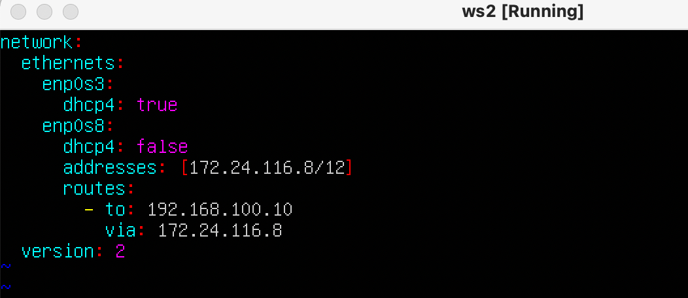

# Linux_Network

## Инструмент **ipcalc**

- Подняли виртуальную машину на Ubuntu 20.04 Server LTS с именем ws1


- Устанавливаем инструмент ipcalc командой
    `sudo apt install ipcalc`


**1.1. Сети и маски**
1) адрес сети 192.167.38.54/13 -> 192.160.0.0/13 (Network)

    

2) перевод маски 255.255.255.0 в префиксную(/24) и двоичную запись
    

3) /15 в обычную и двоичную запись
    

4) *11111111.11111111.11111111.11110000* в обычную и префиксную

    в десятичном формате - *255.255.255.240*
    

***Минимальный и максимальный хост в сети 12.167.38.4 при масках: /8, 11111111.11111111.00000000.00000000, 255.255.254.0 и /4***


минимальный и максимальный хост в сети *12.167.38.4*
при маске */8* (*12.0.0.1* - *12.255.255.254*)


при маске *11111111.11111111.00000000.00000000* (*12.167.0.1* - *12.167.255.254*)


при маске */4* ( *0.0.0.1* - *15.255.255.254*)

- **1.2 localhost**

    Приложение, работающее на localhost, означает, что приложение запущено и функционирует на том же компьютере (или сервере), с которого производится запрос к нему.
    
    Такое приложение использует сетевой адрес ***127.0.0.0/8***, который является специальным адресом для обратной связи на компьютере. Весь трафик, направленный на этот адрес, остается внутри компьютера и не покидает его сетевой интерфейс.
    
    Для того, чтобы определить, можно ли обратиться к приложению, работающему на localhost, со следующими IP: *194.34.23.100*, *127.0.0.2*, *127.1.0.1*, *128.0.0.1,* пропингуем эти адреса:
    ****

    
    Итог: рабочие IP для приложений на localhost - *127.0.0.2* и *127.1.0.1.*

- **1.3. Диапазоны и сегменты сетей**
    - **Частные и публичные IP-адреса**
        
        **Частные IP-адреса**  используются внутри частных сетей, таких как домашние сети или корпоративные внутренние сети. Они не маршрутизируются напрямую в интернете и используются для связи внутри ограниченной сети. Это помогает управлять адресным пространством и уменьшить количество уникальных IP-адресов, которые требуются.
        
        Следующие диапазоны адресов зарезервированы для частных ( LAN —Local Area Network) сетей:
        
        - *10.0.0.0 - 10.255.255.255 (10.0.0.0/8)*
        - *172.16.0.0 - 172.31.255.255 (172.16.0.0/12)*
        - *192.168.0.0 - 192.168.255.255 (192.168.0.0/16)*
        - *127.0.0.0 - 127.255.255.255* —
            
            Зарезервировано для петлевых интерфейсов (не используется для связи между узлами сети) — localhost
            
        
        Эти адреса могут быть использованы внутри сети для назначения устройствам, но они не могут напрямую использоваться в интернете. Для связи между частной сетью и интернетом обычно используется NAT (Network Address Translation), который позволяет переводить частные IP-адреса в общедоступные IP-адреса.
        
        **Публичные IP-адреса:**
        Публичные IP-адреса используются для идентификации устройств в интернете. Они уникальны и могут быть использованы для связи с другими устройствами в глобальной сети. Публичные IP-адреса требуются для серверов, веб-сайтов, облачных услуг и других устройств, доступных из интернета. 
        Публичные IP-адреса присваиваются организациями провайдерами интернет-услуг или другими ресурсами, управляющими адресным пространством.
        
    
    1) В качестве публичных можно использовать следующие адреса: *134.43.0.2, 172.0.2.1*, *192.172.0.1*,  *172.68.0.2*, *192.169.168.1.*
    
    В качестве частных: *10.0.0.45, 192.168.4.2*, *172.20.250.4*, *172.16.255.255*, *10.10.10.10.*
    
    2) Какие из перечисленных IP адресов шлюза возможны у сети *10.10.0.0/18*: *10.0.0.1*, *10.10.0.2*, *10.10.10.10*, *10.10.100.1*, *10.10.1.255?*
    
    посмотрим расчет сети с помощью `ipcalc` для *10.10.0.0/18*

    
    
    **Шлюз должен иметь IP-адрес, который находится в том же диапазоне, что и IP-адреса устройств в данной сети.**
    
    Таким образом, у сети *10.10.0.0/18*   возможны следующие IP адреса шлюза: *10.10.0.2, 10.10.10.10*, *10.10.1.255* (входят в диапазон)*.*
    
    Адреса *10.0.0.1* и *10.10.100.1* являются частью другой сети.

## 2. Статическая маршрутизация между двумя машинами

- Подняли вторую виртуальную машину на Ubuntu 20.04 Server LTS с именем ws2


  У обеих машин в настройках сети, “Адаптер 2” выбираем “Внутренняя сеть” и выбираем/задаем имя (имя внутренней сети должно быть одинаковое у обеих машин).


настройка внутренней сети

C помощью команды `ip addr` выведем существующие сетевые интерфейсы


Cетевые интерфейсы на машине ws1


Cетевые интерфейсы на машине ws2

Видно, что у обеих машин по 3 интерфейса. Третий из них - для внутренней сети - не активирован.
    
- **Описание интерфейсов**
    1. **lo (Loopback):** Этот интерфейс является "петлей обратной связи" и используется для локальных коммуникаций внутри самого устройства. В данном случае, у него есть IPv4-адрес 127.0.0.1 и IPv6-адрес ::1, что позволяет устройству обращаться к самому себе.
    2. **enp0s3:** Это сетевой интерфейс, подключенный к виртуальной сети "NAT" в VirtualBox. Ему назначен динамический IPv4-адрес 10.0.2.15. Этот интерфейс используется для взаимодействия вашей виртуальной машины с внешним миром через NAT-маршрутизацию.
    3. **enp0s8:** Этот сетевой интерфейс находится в состоянии DOWN, что означает, что он не активирован.
    
    Чтобы активировать сетевой интерфейс на обеих машинах:
    
    1) В файле *etc/netplan/00-installer-config.yaml* опишем сетевой интерфейс, соответствующий внутренней сети: добавляем **адреса и маски для обеих машин. 


 ws1 - *192.168.100.10*, маска */16*


ws2 - *172.24.116.8*, маска */12*

2) После внесения изменений вызываем команду `sudo netplan apply` , чтобы применить изменения, внесенные в конфигурационные файлы.


ws1 - enp0s8 - настройки изменились


ws2 - enp0s8 - настройки изменились

- **2.1 Добавление статического маршрута вручную**
    - Команда `ip r add` используется для добавления пользовательских маршрутов в таблицу маршрутизации, позволяет вручную настроить, каким образом пакеты будут направляться к определенным сетям или хостам.
        
        ```bash
        sudo ip route add <сеть/хост> via <шлюз> dev <интерфейс>
        ```
        
        Где:
        
        - `<сеть/хост>`: Целевая сеть или IP-адрес хоста - **КУДА**
        - `<шлюз>`: IP-адрес шлюза (маршрутизатора), через который пакеты будут направляться к указанной сети/хосту - **ОТКУДА**
        - `<интерфейс>`: Имя сетевого интерфейса, через который будут отправляться пакеты к указанной сети/хосту.
    
    Для ws1 вызовем команду
    
     `sudo ip r add 172.24.116.8 via 192.168.100.10 dev enp0s8` , 
    


добавили статический маршрут ws1 - ws2

Для ws2 вызовем команду 
    
`sudo ip r add 192.168.100.10 via 172.24.116.8 dev enp0s8` , 


добавили статический маршрут до ws1

Пропингуем соединение с помощью `ping -c 5` на обеих машинах


ping ws1-ws2


ping ws2-ws1

- **2.2 Добавление статического маршрута с сохранением**
    
    Так как команда **`ip r add`** используется для добавления временного (не постоянного) маршрута в таблицу маршрутизации, добавим маршрут так, чтобы он сохранялся при перезагрузке системы.
    
    Перезапустим машины `sudo reboot` и добавим статический маршрут от одной машины до другой с помощью файла *etc/netplan/00-installer-config.yaml.*

    

    добавили статический маршрут ws1 - ws2

    

     добавили статический маршрут ws2 - ws1
    
    После внесения изменений вызвана команда `sudo netplan apply` и пропинговано соединение между машинами.

    

    ping ws1-ws2

    
    ping ws2-ws1

## 3. Утилита **iperf3**

- **3.1. Скорость соединения**
    
    Чтобы перевести скорость из мегабитов в секунду (Mbps) в мегабайты в секунду (MB/s), нужно разделить значение в мегабитах на 8, так как в 1 байте содержится 8 битов.
    
    - 8 Mbps == 1MB/s (/8)
    - 100 MB/s == 800 000Kbps 
    переводим мегабайты в мегабиты → 100MB/s * 8 == 800Mbps 
    переводим мегабиты в килобиты → 800Mbps * 1 000 = 800 000Kbps
    - 1 Gbps == 1 000Mbps (*1000)
    
- **3.2. Утилита iperf3**
    
    Устанавливаем утилиту `sudo apt install iperf3`
    
    ws1 будет выступать в роли сервера, поэтому выполняем команду `iperf3 -s`

    

    ws2 будет выступать в роли клиента, выполняем команду `iperf3 -c 192.168.100.10`
    
    Далее происходил обмен трафиком, и выведена средняя скорость передачи данных - 3.50Gbps

    

    результат работы утилиты iperf3 между машинами ws1-ws2

## 4. Сетевой экран

- Создаем файл */etc/firewall.sh*, имитирующий фаерволл, на ws1 и ws2:

    - на ws1 написать сначала запрещающее, а потом разрешающее правило на пинг
    - на ws2 ровно наоборот

    - откроем на машинах доступ для порта 22 (ssh) и порта 80 (http)
    `iptables -t filter -A INPUT -p tcp --dport 22 -j ACCEPT`
        
        Запрещающее правило:
        
        `iptables -A OUTPUT -p icmp --icmp-type echo-reply -j DROP`
        
        Разрешающее правило:
        
        `iptables -A OUTPUT -p icmp --icmp-type echo-reply -j ACCEPT`

    Итого, файлы */etc/firewall.sh* на машинах выглядят следующим образом:
     на ws1
     на ws2


    Запустим скрипты: `chmod +x /etc/firewall.sh` и `/etc/firewall.sh`
    выведем результат их работы: `sudo iptables -L --line-numbers` 
    и пропигуем обе машины.

 

 правила фильтрации трафика на ws1, ws2 пингуется


 правила фильтрации трафика на ws2, ws1 не пингуется


    Разница между стратегиями, примененными в первом и втором файлах, состоит в том, что в приоритет имеет правило, заданное первым. Именно поэтому ws1 пропинговать не получается, так как там первое правило - запрещающее, а ws2 можем, так у там первое правило - разрешающее.
    
- **4.2. Утилита nmap**
    
    Устанавливаем утилиту `sudo apt install nmap` .
    
    Пингуем ws2 - ws1, видим, что отклика нет, после вызываем `nmap 192.168.100.10` и видим, что хост машины запущен.

    

    результат проверки на то, что ws1 запущена, хоть и не пингуется

- **Сохранение дампов образов виртуальных машин**

    Дамп - состояние машины.
    
    Сохраняем текущее состояние в интерфейсе VirtualBox.

    

## 5. Статическая маршрутизация сети


сетевые настройки ws11


сетевые настройки ws21


сетевые настройки ws22


сетевые настройки r1


сетевые настройки r2

Командой `netplan apply` примененили изменения, внесенные в конфигурацию сети.
    Проверяем, что настройки применены
    


сетевые интерфейсы r2


Пингуем ws22 с ws21


пингуем ws11 - r1

- **5.2. Включение переадресации IP-адресов**
    
    Для включения переадресации выполняем команду на роутерах:
    
    `sysctl -w net.ipv4.ip_forward=1`

    
    
    включена переадресация на r1

    

    включена переадресация на r2

    При выполнении вышеуказанной команды переадресация не будет работать после перезагрузки системы, поэтому в файле */etc/sysctl.conf*  расскомментируем следующую строку - `net.ipv4.ip_forward = 1`

    

    включение постоянной переадресации на r1 и r2 в файле */etc/sysctl.conf*

- **5.3. Установка маршрута по-умолчанию**

    Настроим маршрут по умолчанию (шлюз) для рабочих станций, для этого добавим `default` перед IP роутера в файле конфигураций

    

    добавлен шлюз по умолчанию на ws11

    

    добавлен шлюз по умолчанию на ws21

    

    добавлен шлюз по умолчанию на ws22

    Проверка, что маршрут добавился в таблицу маршрутизации  `ip r`

    

    добавлен шлюз по умолчанию на ws11

    Для того, чтобы пропинговать с ws11 роутер r2,  используем команду 
    
    `tcpdump -tn -i enp0s9`

    - **Описание команды**
        
        Команда используется для захвата и вывода сетевого трафика на определенном сетевом интерфейсе с помощью утилиты `tcpdump` :
        
        - `tn`: Эти флаги указывают на определенные опции для форматирования вывода:
            - `t`: Отключает вывод времени, что означает, что временные метки пакетов не будут отображаться в выводе.
            - `n`: Отключает разрешение имен хостов и сервисов в IP-адреса и порты. Это полезно, если вы хотите видеть числовые IP-адреса и порты.
        - `i eth1`: Этот флаг указывает `tcpdump` на интерфейс, на котором нужно захватывать сетевой трафик. В данном случае, `eth1` - это имя сетевого интерфейса.
        
        Таким образом, команда `tcpdump -tn -i eth1` захватывает сетевой трафик на интерфейсе `eth1` и выводит его в числовом формате, отключая при этом отображение временных меток и разрешение имен хостов и сервисов. 
        
    
    Запускаем `tcpdump` на r2, чтобы отслеживать трафик на машине

    

    запустили tcpdump на r2

    C ws11 начинаем пинговать r2  `ping -c 5 10.100.0.12`

    

    ping ws11-r2

    на r2 видим что запросы получены

    

    echo request на r2
    
    Роутер r2 получает запросы echo request , но ответ не отправляет, так как не прописан обратный адрес.

    - **5.4. Добавление статических маршрутов**

    

    для r1 шлюзом в сеть 10.20.0.0 будет 10.100.0.12

    

    для r2 шлюзом в сеть 10.10.0.0 будет 10.100.0.11

    С помощью `ip r` убедимся, что статический маршрут добавлен

    

    сетевые маршруты r1
    
    

    сетевые маршруты r2

    **Запустить команды на ws11:**
    
    Вызов команды `ip r list 10.10.0.0/18` выведет информацию о маршруте, связанном с конкретной подсетью.
    
    Вызов команды `ip r list 0.0.0.0/0` используется для вывода информации о маршруте по умолчанию. Подсеть `0.0.0.0/0` представляет собой маршрут по умолчанию, который охватывает все возможные IP-адреса. Он указывает, как отправлять сетевой трафик, который не имеет явно заданного маршрута, или для которого не существует более конкретных маршрутов.

    

    сетевые маршруты ws11
    
    Для адреса 10.10.0.0/18 был выбран маршрут, отличный от 0.0.0.0/0, так как машина ws11 соединена с сетью 10.10.0.0/18 по своему IP-адресу 10.10.0.2, для других адресов используется маршрут по умолчанию, который указан в файле - 10.10.0.1.

- **5.5. Построение списка маршрутизаторов**
    - **Описание утилиты traceroute**
        
        Утилита `traceroute` используется для определения маршрута, по которому пакеты данных следуют от отправителя к получателю через сеть, и для вычисления времени, которое требуется для передачи данных между различными узлами сети → позволяет отслеживать "путь" пакетов через сеть, а также измерять задержки (пинг) на каждом промежуточном узле.
        
        `traceroute` также позволяет измерить время (задержку) между отправлением пакета и получением ответа от каждого узла. Это может помочь выявить узкие места или медленные участки в сети.
        
    
    Запускаем на r1 команду дампа `tcpdump -tnv -i enp0s8`
    
    Опции -tnv указывают `tcpdump` отобразить вывод в числовом формате, без разбора имен хостов и портов, и включить подробную информацию о пакетах.

    

    запущена команда отслеживания сетевого трафика в реальном времени на r1
    
    На ws11 запустили `traceroute 10.20.0.10`

    

    список маршрутизаторов на пути от ws11 до ws21
    
    Принцип работы утилиты `traceroute` основан на отправке сетевых **пакетов с TTL** и анализе ответов от промежуточных узлов сети. 
    **Пакет данных с TTL**  означает сетевой пакет, в котором задано значение TTL, которое определяет количество промежуточных узлов, через которые пакет может проходить, прежде чем быть отброшенным. TTL является частью заголовка IP-пакета и используется для предотвращения зацикливания или бесконечного циркулирования пакетов в сети.
    Вот как происходит построение пути при помощи `traceroute`:
    
    1. Когда запускается `traceroute` к какому-либо адресу (IP-адресу или доменному имени), он начинает отправлять пакеты данных с TTL (Time To Live), установленным на 1, к указанному адресу. 
    2. Первый узел (роутер) в сети, через который проходит пакет, уменьшает значение TTL на 1. Если после уменьшения значение TTL становится равным 0, узел отбрасывает пакет и отправляет обратно сообщение "Time Exceeded" обратно отправителю.
    3. Отправитель `traceroute` записывает информацию о первом узле, через который прошел пакет, а затем увеличивает значение TTL на 1 и отправляет следующий пакет.
    4. Процесс повторяется: каждый промежуточный узел уменьшает TTL, и если TTL достигает 0, он отправляет обратно сообщение "Time Exceeded". Отправитель записывает информацию об этом узле и переходит к следующему шагу.
    5. Когда пакет наконец достигает финального пункта назначения (конечного IP-адреса), пункт назначения отправляет ответ "ICMP Echo Reply" (если протокол ICMP используется для пакетов), который достигает отправителя `traceroute`.
    6. `traceroute` завершает свою работу, предоставляя список всех узлов (роутеров), через которые проходили пакеты, и информацию о времени, которое требовалось для прохождения каждого узла.
    
    Таким образом, `traceroute` позволяет отследить маршрут, который пакеты данных проходят от отправителя к получателю через сеть, а также измерить задержки (пинг) на каждом промежуточном узле.
    
- **5.6. Использование протокола ICMP при маршрутизации**

    Запускаем на r1 перехват сетевого трафика `tcpdump -n -i enp0s8`
    
    

    Пингуем с ws11 несуществующий IP с помощью команды`ping -c 1 10.30.0.111`

    Видим, что `tcpdump` отловил запрос

    

    tcpdump отловил запрос на r1

    Сохраняем дампы

    

## 6. Динамическая настройка IP с помощью **DHCP**

- **Настроим на машине r2 службу DCHP**
    
    Для r2 настраиваем в файле /etc/dhcp/dhcpd.conf конфигурацию службы DHCP.
    
    Чтобы появился файл, который будем редактировать нужно установить пакет 
    `apt-get install isc-dhcp-server`.

    Утилита`isc-dhcp-server` позволяет настроить и управлять сервером DHCP, предоставляя IP-адреса и другие параметры клиентам.
    ****
    
    

    конфигурация службы DHCP на r2
    
    В файле /etc/resolv.conf пропишем `nameserver 8.8.8.8`

    - **Информация о resolv.conf**
        
        Файл `resolv.conf` содержит информацию о настройках DNS (Domain Name System) в операционной системе Linux. Он указывает системе, какие DNS-серверы использовать для разрешения доменных имен в IP-адреса.

    

    Перезагружаем службу DHCP командой `systemctl restart isc-dhcp-server` 

    

    перезагрузка службы DHCP

    У машины ws21 в конфиге /etc/netplan/00-installer-config.yaml для интерфейса enp0s8 включаем `dhcp4: true` , чтобы интерфейс запрашивал сетевую конфигурацию у DHCP-сервера (машины r2), и комментируем заданные настройки IP адреса

    

    включили запрос сетевой конфигурации интерфейсом enp0s8 у DHCP-сервера
    на ws21
    
    После этого перезагружает машину ws21 через `sudo reboot`

    

    IP адрес интерфейса enp0s8 после запроса конфигурации у DHCP-сервера (машины r2) на ws21

    Пингуем ws21 с ws22

    

- **Настроим на машине r1 службу DCHP с жесткой привязкой к MAC-адресу (ws11)**
    - **Что означает “жесткая привязка к MAC-адресу”**
        
        - это означает, что  DHCP-сервер назначает определенные IP-адреса и другие сетевые настройки для конкретных устройств (клиентов) в сети, исходя из их уникальных MAC-адресов.
        
        В обычной ситуации, DHCP-сервер назначает IP-адреса динамически клиентам в сети. Это означает, что каждый раз, когда устройство запрашивает сетевую конфигурацию у DHCP-сервера, сервер может назначить ему разный IP-адрес. Это удобно для многих устройств, но иногда бывает полезно иметь статический (постоянный) IP-адрес для определенных устройств.
        
        !!!! Настройка DHCP-сервера с жесткой привязкой к MAC-адресу гарантирует, что каждый раз, когда устройство запрашивает сетевую конфигурацию, DHCP-сервер всегда будет назначать ему один и тот же IP-адрес.
        
        Это особенно полезно, если у вас есть устройства, которым необходимо иметь постоянный IP-адрес для определенных сервисов или настроек в сети. 
        
    
    Указываем MAC адрес у ws11, для этого в etc/netplan/00-installer-config.yaml надо добавить строки: `macaddress: 10:10:10:10:10:BA`, `dhcp4: true`

    

    указан MAC-адрес в сетевом конфиге на ws11
    
    Важно выключить машину и в настройках сети поменять MAC-адрес на новый

    

    Настраиваем r1 аналогично r2:
    
    - устанавливаем утилиту `apt-get install isc-dhcp-server` для того, чтобы r1 смог выполнять функцию DHCP-сервера
    - настраиваем в файле /etc/dhcp/dhcpd.conf конфигурацию службы DHCP

    

    - в файле /etc/resolv.conf пропишем `nameserver 8.8.8.8`

    

    настройка DNS на r1

    - перезагружаем службу DHCP командой `systemctl restart isc-dhcp-server` , на ws11 делаем `sudo reboot`

    Проверяем, что у интерфейса enp0s8  ws11 изменился MAC-адрес и IP адрес

    

    сетевые интерфейсы ws11
        
    Пропингуем ws22 - ws21

    

- **Запросим с ws21 обновление IP адреса**
    
    Сначала проверим текущий адрес

    

    сетевые интерфейсы ws21

    Чтобы обновить или освободить IP-адрес для конкретного интерфейса, в нашем случае для enp0s8, необходимо ввести 
    
    `sudo dhclient -r enp0s8` и `sudo dhclient enp0s8`
    
    Первая команда освободит текущий IP адрес, а вторая запросит новый

    

    - освободили IP адрес интерфейса enp0s8
    - новый IP адрес интерфейса после запроса к DHCP-серверу (машине r2)

- **Сохраняем дампы образов виртуальных машин**

    дампы образов виртуальных машин после выполнения задания №6

    


## 7. **NAT**

**В данном задании используются виртуальные машины из Части 5 (используем дампы)!**

- Установим утилиту apache2 `sudo apt install apache2` на ws22 и r1.
    - **Что такое Apache**
        
        Apache HTTP Server, также известный как Apache, является одним из самых популярных веб-серверов в мире. Он представляет собой программное обеспечение, которое обрабатывает входящие HTTP-запросы от клиентов (обычно веб-браузеров) и отвечает им, предоставляя веб-страницы, файлы, данные и другой контент.
        
        Применение веб-сервера Apache включает:
        
        1. **Сервер веб-сайтов:** Основное назначение Apache - это обслуживание веб-сайтов. Он может обрабатывать статические файлы (HTML, изображения, CSS, JavaScript) и динамически генерированный контент, такой как веб-страницы, создаваемые с использованием серверных языков программирования (например, PHP, Python, Ruby).
        2. **Виртуальные хосты:** Apache поддерживает настройку виртуальных хостов, что позволяет размещать несколько веб-сайтов на одном сервере с разными доменными именами или IP-адресами.
        3. **Прокси-сервер:** Apache может использоваться как прокси-сервер для пересылки запросов клиентов другим серверам, например, для балансировки нагрузки или для обеспечения дополнительных служб без прямого доступа клиентов к ним.
        4. **Обработка запросов:** Он поддерживает различные методы и модули для обработки и анализа входящих HTTP-запросов, что позволяет создавать сложные веб-приложения и API.
        5. **Защита и безопасность:** Apache предоставляет функциональности для настройки безопасности и защиты веб-приложений от атак, таких как инъекции и переполнения буфера.
        6. **Модульность:** Одной из сильных сторон Apache является его модульная архитектура. Это означает, что вы можете добавлять и настраивать различные модули в соответствии с вашими потребностями.
        7. **Отладка и анализ:** Apache предоставляет журналы доступа и журналы ошибок, которые помогают администраторам отслеживать и анализировать действия и проблемы на сервере.
    
    В файле /etc/apache2/ports.conf на ws22 и r1 меняем строку `Listen 80` 
    на `Listen 0.0.0.0:80`, то есть делаем сервер Apache2 общедоступным.

    

    Внесли изменения в конфиг на ws22 и r1
    
    - Запускаем веб-сервер командой `service apache2 start`

    

    

    запуск веб-сервера на ws22 и r1

- Создадим /etc/firewall.sh на r2
    - Добавим правила:
        
        1) удаление правил в таблице filter - `iptables -F`
        
        2) удаление правил в таблице "NAT" - `iptables -F -t nat`
        
        3) отбрасывать все маршрутизируемые пакеты - `iptables --policy FORWARD DROP`
        
        - **Подробное описание команд**
            1. `iptables -F`: Эта команда очищает все правила (фильтров) в цепочках (chains) по умолчанию (INPUT, FORWARD, OUTPUT) и устанавливает политику ACCEPT для каждой цепочки. Это фактически отключает фильтрацию трафика, так как все пакеты будут разрешены.
            2. `iptables -F -t nat`: Эта команда аналогична предыдущей, но применяется к таблице NAT. Таблица NAT используется для изменения сетевых адресов и портов в пакетах. Очищение этой таблицы также отключит все правила в ней.
            3. `iptables --policy FORWARD DROP`: Эта команда устанавливает политику для цепочки FORWARD в таблице фильтрации (FILTER) на DROP. Это означает, что все пакеты, перенаправляемые через систему (например, маршрутизируемые между интерфейсами), будут отбрасываться по умолчанию. Это может использоваться для ужесточения безопасности и контроля над маршрутизацией.
        
        
     на r2](./images/82.png)

    firewall на r2

    - Запустим /etc/firewall.sh: `chmod +x /etc/firewall.sh` и `/etc/firewall.sh`

     на r2](./images/83.png)

    запуск firewall на r2

    

    ping ws22 - r1 не пингуется

    - Добавим еще правила:
        
        4)разрешить маршрутизацию всех пакетов протокола ICMP
        
        `iptables -A FORWARD -p icmp -j ACCEPT`
        
        После добавления команды ws22 пингуется с r1
        
        

        ping ws22 - r1: после разрешения маршрутизации всех пакетов ICMP - проходит
        
        
    5) включить SNAT, а именно маскирование всех локальных ip из локальной сети, находящейся за r2 (сеть 10.20.0.0)
        
        - **Что такое SNAT**
            
            SNAT (Source Network Address Translation) - это метод трансляции адресов сети, используемый, чтобы изменить исходный IP-адрес пакета в сети.
            
            Процесс SNAT осуществляется на маршрутизаторах, брандмауэрах или других устройствах сетевого уровня и позволяет управлять тем, как исходящий трафик будет выглядеть на удаленной стороне. 
            
        
        5.1) Разрешаем маршрутизацию всех TCP-пакетов на 80 порт
        
        `iptables -A FORWARD -p tcp --dport 80 ACCEPT`
        
        5.2)  Разрешаем маршрутизацию для пакетов с уже установленным соединением 
        
        **Внешние пакеты с установленным соединением** (External Packets with Established Connection) относятся к пакетам данных, которые связаны с уже установленным сетевым соединением. В контексте маршрутизации и сетевых правил, такие пакеты имеют особый статус и обрабатываются иначе, чем новые или исходящие пакеты.
        
        `iptables -A FORWARD -p tcp -m state --state ESTABLISHED -j ACCEPT`    
        
        5.3) Изменим исходящий IP адрес для пакетов из сети 10.20.0.0/26
        
        `iptables -t nat -A POSTROUTING -s 10.20.0.0/26 -o enp0s8 -j SNAT --to-source 10.100.10.12`
        
        - **Расшифровка команды**
            
            Эта команда применяется к таблице NAT (`-t nat`) и цепочке POSTROUTING (`-A POSTROUTING`), чтобы выполнить Source Network Address Translation (SNAT) для исходящего трафика, исходящего из сети `10.20.0.0/26` через интерфейс `enp0s8`.
            
            Разберем параметры этой команды:
            
            - `s 10.20.0.0/26`: Этот параметр указывает на исходный IP-адрес отправителя (source), который находится в диапазоне `10.20.0.0` до `10.20.0.63` (маска подсети `/26`).
            - `o enp0s8`: Этот параметр указывает на сетевой интерфейс, через который пакеты будут исходить. В данном случае, это `enp0s8`.
            - `j SNAT --to-source 10.100.10.12`: Этот параметр `j` определяет действие, которое будет выполнено с пакетами, соответствующими этому правилу. В данном случае, действием является SNAT (Source Network Address Translation), то есть перевод исходного адреса отправителя пакетов. Опция `--to-source` указывает, на какой IP-адрес (в данном случае `10.100.10.12`) нужно заменить исходный IP-адрес отправителя.
            
            В итоге, данное правило изменяет исходный IP-адрес отправителя для исходящих пакетов, исходящих из сети `10.20.0.0/26`, через интерфейс `enp0s8` на IP-адрес `10.100.10.12`. Это может быть полезным, например, при настройке маршрутизации для перевода исходных адресов из конкретной подсети.
            
        
        6) включить DNAT на 8080 порт машины r2 и добавить к веб-серверу Apache, запущенному на ws22, доступ извне сети
        
        - **Что такое DNAT**
            
            DNAT (Destination Network Address Translation) - это метод, который изменяет IP-адрес назначения (destination address) пакетов, проходящих через маршрутизатор или брандмауэр.
            
            Когда пакеты приходят на внешний интерфейс маршрутизатора или брандмауэра, DNAT перенаправляет их на другой внутренний IP-адрес, который может быть размещен внутри локальной сети. 
            
        
    `iptables -t nat -A PREROUTING -i enp0s8 -p tcp --dport 8080 -j DNAT --to-destination 10.20.0.20:80`

    

    итоговый файл firewall на r2]

    Проверим соединение по TCP для SNAT, предварительно отключив в конфиге ws22 интерфейс NAT

    

    отключаем NAT на ws22

    Командой `telnet 10.10.0.1 80` тестируем соединение ws22 с r1

    

    проверка соединения ws22 - r1, порт 80

    Проверить соединение по TCP для DNAT командой `telnet 10.20.0.20 8080`
    
    

    проверка соединения  r1 - ws22, порт 8080

    

    Сохраним дампы образов виртуальных машин

## 8. Знакомство с **SSH Tunnels**

Статья про SSH Tunnels - [https://habr.com/ru/articles/331348/](https://habr.com/ru/articles/331348/)

- Запускаем на r2 firewall.sh с правилами из Части 7

- Установили Apache на ws22 `sudo apt install apache2` и запустили веб-сервер только на localhost:80


- Cтавим ssh сервер  на ws21 и ws22
    
    `sudo apt-get install openssh-server`
    
- Отключаем NAT на ws21 и ws22 машинах(!!!)


